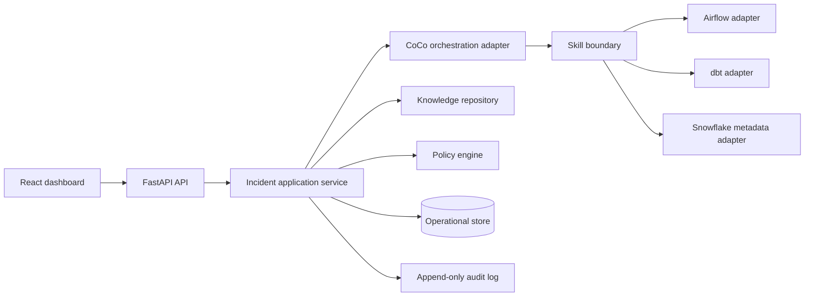
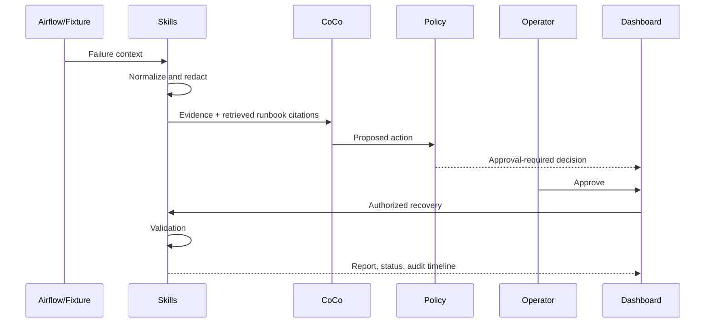

# PipelinePilot Architecture

## Architecture Principles

Build a single deployable backend and a small web client. Keep domain decisions deterministic and testable; let CoCo orchestrate evidence-gathering and structured reasoning only. All external access is behind skills. Demo integrations use fixtures and visibly declare their mode.

## Overall Architecture



| Component | Responsibility |
| --- | --- |
| Dashboard | Shows incident state, evidence, approval controls, audit timeline, RCA, and the read-only active Policy view. Never decides policy. |
| API/application service | Authorizes requests, coordinates state transitions, persists records, and returns stable REST envelopes. |
| CoCo orchestrator adapter | Invokes the local CoCo CLI in one-shot structured-output mode, requests read-only Airflow/Snowflake context and a cited decision, validates its schema, and supports a deterministic demo fallback. |
| Skills | Narrow callable capabilities for external observations or controlled actions. They return typed evidence/results only. |
| Knowledge repository | Stores curated runbooks, previous RCAs, and feedback; retrieves cited, filtered documents. |
| Policy engine | Deterministically calculates risk and permission requirements from action, environment, role, and policy version. |
| Operational store | Persists incidents, execution state, approvals, feedback, and documents. SQLite is adequate for the demo; Snowflake/Postgres is a later deployment choice. |

## Backend Architecture

Suggested structure:

```text
backend/
  app/
    api/              # route handlers and request/response schemas
    domain/           # entities, enums, policy/result contracts
    services/         # incident, approval, recovery, reporting workflows
    skills/           # contracts plus monitoring/log/dbt/metadata/recovery/validation
    integrations/     # Airflow, dbt, Snowflake, CoCo, fixture adapters
    knowledge/        # ingest, retrieval, ranking
    security/         # RBAC, redaction, secret references
    persistence/      # repositories and migrations
    config/           # typed settings; no secrets committed
  tests/
frontend/
  src/main.tsx        # dashboard shell, incident workflow, and Policy view
  src/styles.css      # design tokens and responsive presentation styles
data/                 # versioned demo fixtures, policies, and sanitized runbooks
docs/
```

Dependency rule: `api → services → domain`; services may depend on interfaces in `skills`, `knowledge`, and `persistence`; only `integrations` implements external interfaces. `domain` depends on nothing outside itself. Frontend accesses backend only through REST. CoCo never bypasses the skill boundary.

## Agent Skill Architecture

| Skill | Responsibility | Inputs | Outputs | Dependencies | Failure handling |
| --- | --- | --- | --- | --- | --- |
| Monitoring | Locate failed DAG/task/run status | pipeline/run ID | normalized run status | Airflow/fixture | return `UNAVAILABLE` evidence; continue investigation |
| Log investigation | Extract error signature and sanitized evidence | task/run ID | summary, signatures, citations | Airflow logs/redactor | redact first; return partial evidence |
| dbt health | Read model/test/freshness results | run/model ID | failed checks, lineage context | dbt artifacts/fixture | mark stale/missing artifacts |
| Snowflake metadata | Read-only operational context | object/query window | schema/freshness/warehouse context | Snowflake read-only role | no SQL execution; return unavailable context |
| Knowledge retrieval | Find organization guidance | sanitized incident synopsis | ranked document excerpts/IDs | document store | return no-match, never fabricate citations |
| Decision | Synthesize a schema-valid recommendation | evidence + docs | cause, confidence band, action, rationale | CoCo adapter | reject malformed/unreferenced output; use deterministic fallback |
| Policy | Decide action permission | action, environment, actor role | decision/risk/reason/version | policy repository | default deny on absent/invalid policy |
| Recovery | Execute approved idempotent action | execution ID, action | status and external reference | controlled Airflow/sandbox | require policy/approval token; no implicit retry |
| Validation | Check expected recovery signals | execution/incident ID | pass/fail checks | dbt/metadata/monitoring | report partial/failed validation; do not close incident |
| Incident report | Render RCA | incident + audit + evidence | structured report | templates | mark unavailable evidence explicitly |

Context skills use versioned contracts with a `SkillContext` input and `SkillResult` output. Results carry a normalized `Evidence` value when available, an `AVAILABLE`/`DEGRADED`/`UNAVAILABLE` status, adapter mode, and a safe degradation reason. Fixture adapters and the opt-in CoCo CLI adapter implement the same boundary; the CoCo path uses built-in read-only Airflow and Snowflake capabilities and never performs recovery writes.

## CoCo Orchestration Flow

1. Incident service calls monitoring, logs, dbt, and metadata skills concurrently with bounded timeouts.
2. Redaction service sanitizes all returned text and stores a redaction summary.
3. Knowledge skill retrieves filtered documents using failure signature, pipeline, and tags.
4. CoCo receives only sanitized, typed evidence plus document citations and chooses/summarizes a recommendation using the Decision skill contract.
5. The backend validates the decision schema and asks the deterministic Policy skill to evaluate the proposed action.
6. If approval is required, orchestration stops in `AWAITING_APPROVAL`. If allowed, the service may create an execution; the demo still exposes an explicit operator action.
7. Recovery runs only after the service verifies approval/policy/version/idempotency. Validation follows recovery. The service writes audit events at every boundary and generates the report.

## Data Flow



## API Design

| Method / path | Purpose | Minimum role |
| --- | --- | --- |
| `GET /v1/incidents` | List incidents | Viewer |
| `POST /v1/incidents` | Create/ingest seeded incident | Operator |
| `GET /v1/incidents/{id}` | Detail, evidence, recommendation | Viewer |
| `POST /v1/incidents/{id}/investigate` | Run investigation workflow | Operator |
| `POST /v1/incidents/{id}/approvals` | Approve/reject pending action | Operator |
| `POST /v1/incidents/{id}/executions` | Start a policy-authorized recovery | Operator |
| `POST /v1/incidents/{id}/validate` | Run validation | Operator |
| `GET /v1/incidents/{id}/report` | Read RCA | Viewer |
| `POST /v1/incidents/{id}/feedback` | Record correction | Operator |
| `GET /v1/policies/current` | Read active policy | Viewer |
| `GET /v1/audit-logs` | Query audit events | Admin |
| `GET /v1/demo/status` | Read fixture/database/adapter readiness | Viewer |
| `POST /v1/demo/reset` | Recreate the seeded fixture store | Admin, fixture mode only |

All mutation endpoints use request IDs/idempotency keys, return `correlation_id`, and reject unauthorized transitions with machine-readable errors. Approval requests explicitly support both approved and rejected decisions. Reports include recommendation, policy decision, evidence, execution, validation, audit, and feedback metadata.

In fixture mode, request identity is supplied through `X-Actor-Id` and `X-Actor-Role` headers. Missing headers resolve to a read-only Viewer identity; authorization is enforced by reusable server-side dependencies rather than UI state.

## Database Design

| Table | Key fields |
| --- | --- |
| `incidents` | `id`, pipeline/run identifiers, status, severity, summary, timestamps |
| `incident_evidence` | `id`, `incident_id`, source, type, sanitized payload, hash, collected_at |
| `audit_logs` | `id`, correlation/incident IDs, event type, actor, policy version, before/after hashes, timestamp |
| `policies` | `id`, version, environment, rule JSON, active, effective_at |
| `approvals` | `id`, incident/execution IDs, decision, actor, reason, created_at |
| `feedback` | `id`, incident ID, recommendation/outcome correction, actor, created_at |
| `knowledge_documents` | `id`, title, type, tags, source/version, sanitized content, checksum |
| `knowledge_chunks` | `id`, document ID, text, metadata, optional embedding reference |
| `execution_history` | `id`, incident ID, action, idempotency key, policy/approval IDs, status, external ref, timestamps |
| `recommendations` | `id`, incident ID, validated decision JSON, created_at |
| `validation_results` | `execution ID`, incident ID, validation JSON, created_at |

Use foreign keys, immutable append-only audit records, and indexes on incident status, pipeline/run IDs, and knowledge tags. The MVP uses SQLite migrations and typed repositories. Store raw sensitive logs outside the application store—or not at all in the MVP.

## Security Architecture

Authenticate users and map them to Viewer, Operator, or Admin roles server-side. Give each integration a separate least-privilege identity; Snowflake access is read-only for metadata and no agent owns a general-purpose SQL credential. Redact PII before persistence outside a restricted evidence zone and before any CoCo call. Read secrets from deployment-managed secret references, never API requests, logs, fixtures, or Git. Audit authentication, authorization, policy, approval/rejection, execution, and validation events with correlation IDs.

## RAG Architecture

The MVP ingests small, reviewed Markdown runbooks and sanitized RCA/feedback records. It chunks by procedure section, attaches document type/pipeline/failure tags/version, and uses tag filtering plus lexical ranking. Retrieval returns excerpts, document IDs, and scores; the Decision skill can cite only returned IDs. An optional embedding provider can later populate `knowledge_chunks` without changing callers. Document review/versioning is more valuable than embedding sophistication in week one.

## Policy Engine

Rules match action, environment, incident severity, retry count, and role. They calculate risk (`LOW`, `MEDIUM`, `HIGH`, `CRITICAL`) and decision (`ALLOW`, `APPROVAL_REQUIRED`, `DENY`). The engine returns the matched rule, policy version, reasons, and required approver role. Default is deny. Approval binds to an immutable execution request and expires on policy/action/evidence change. Model advice cannot override a policy result.

Milestone 5 uses a deterministic fixture recovery path. Execution proposals carry a SHA-256 request fingerprint over the incident snapshot, action, policy decision/version, and evidence IDs. Approval creates a planned execution record before binding the approval. Recovery requires the matching approval and idempotency key, then moves through `EXECUTING` and `RECOVERED`; validation alone may move the incident to `VALIDATED`. Failed or blocked records remain persisted and auditable.

Milestone 6 exposes these services through a FastAPI application factory. API dependencies provide SQLite repositories, fixture-header identity, role authorization, correlation IDs, and idempotency keys. Responses use typed `/v1` contracts; failures return a safe error envelope and never expose raw fixture payloads or credentials. The React dashboard reads incident detail from the API and presents investigation, approval, recovery, validation, report, feedback, and read-only policy controls. Fixture mode remains the default; the opt-in CoCo bridge is the only live-context path.

Milestone 7 adds a demo control plane. `GET /v1/demo/status` reports mode, seed, database, and whether context/decision adapters are fixture-backed or CoCo-backed. Admin-only `POST /v1/demo/reset` recreates the local fixture store and seeds the schema-drift incident; it remains unavailable outside fixture mode. End-to-end tests exercise denial and happy paths, while the replay script provides a deterministic backup demonstration without browser state. The default remains the typed fixture decision fallback; `PIPELINEPILOT_COCO_ENABLED=true` opts into the live CoCo CLI bridge.

## Future Scaling

Replace fixture adapters with queued workers and production connectors; move state to Postgres/Snowflake, documents to governed storage/Cortex Search, and audit to a tamper-evident event stream. Add SSO, tenant/environment boundaries, distributed idempotency, connector health checks, approval delegation, evaluation datasets, and observability for skill latency and decision quality. Keep the skill contracts and deterministic policy engine unchanged.
